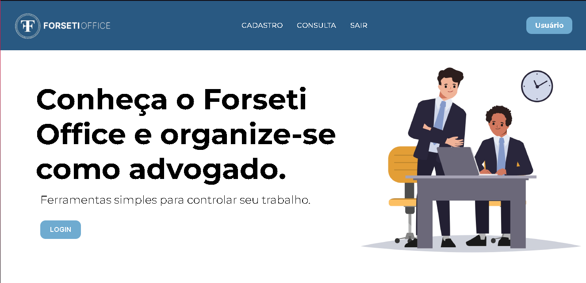

# Projeto CRUD

> Projeto CRUD, Utilizado uma base CSS do projeto ForsetiOffice (TCC)

Projeto de um sistema CRUD realizado em 06/2023 como exercício para estudar a utilização de sessions php e conexão com banco de dados realizado pela equipe Sov4Technology.

## Tecnologia ⚒
- PHP
- HTML 
- CSS 
- JS
- Banco de Dados MySQL
- Git e Github

## Contato 💙
ismael.velosoct@gmail.com
sov4tech@gmail.com
